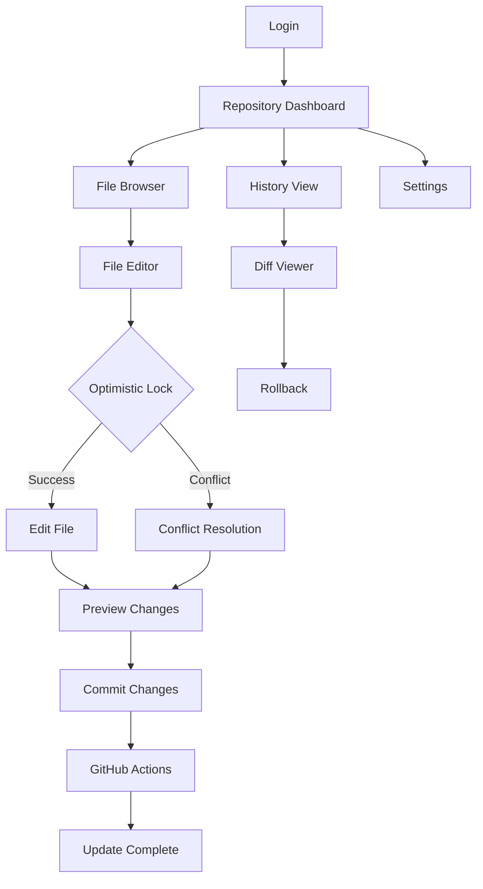

## 1. Product Overview

Process Point is a GitHub Pages-based application that manages JSON configuration files with GitHub Actions integration and optimistic SHA locking for collaborative editing. It enables teams to safely edit and manage JSON configuration files stored in GitHub repositories with version control and conflict resolution.

The product solves the problem of collaborative JSON file editing by providing a web interface with optimistic locking, preventing conflicts when multiple users edit the same file simultaneously while maintaining full Git history.

## 2. Core Features

### 2.1 User Roles

| Role | Registration Method | Core Permissions |
|------|---------------------|------------------|
| Repository Owner | GitHub OAuth | Full access to all files, can manage repository settings |
| Collaborator | GitHub OAuth + Repository invitation | Can edit files, view history, create pull requests |
| Viewer | GitHub OAuth | Read-only access to files and history |

### 2.2 Feature Module

Our Process Point requirements consist of the following main pages:
1. **Repository Dashboard**: Browse repositories, file listing, quick actions.
2. **File Editor**: JSON editor with syntax highlighting, optimistic locking, save/preview.
3. **History View**: File change history, diff viewer, rollback functionality.
4. **Settings**: Repository configuration, user preferences, access management.

### 2.3 Page Details

| Page Name | Module Name | Feature description |
|-----------|-------------|---------------------|
| Repository Dashboard | Repository Browser | Display list of accessible GitHub repositories with search and filter options. |
| Repository Dashboard | File Listing | Show JSON files in selected repository with folder structure navigation. |
| Repository Dashboard | Quick Actions | Provide shortcuts to create new files, upload files, or access recent files. |
| File Editor | JSON Editor | Monaco-based editor with syntax highlighting, validation, and formatting for JSON files. |
| File Editor | Optimistic Locking | Implement SHA-based locking mechanism to prevent concurrent edit conflicts. |
| File Editor | Save/Preview | Allow users to preview changes before committing, with save creating GitHub commits. |
| File Editor | Conflict Resolution | Detect and handle merge conflicts with visual diff and resolution options. |
| History View | Change History | Display chronological list of file changes with commit messages and authors. |
| History View | Diff Viewer | Show side-by-side comparison of file versions with highlighted changes. |
| History View | Rollback | Allow users to revert to previous versions with confirmation dialog. |
| Settings | Repository Config | Configure default branch, file patterns, and access permissions. |
| Settings | User Preferences | Set editor preferences, theme, and notification settings. |
| Settings | Access Management | Manage repository collaborators and their permission levels. |

## 3. Core Process

### Repository Owner Flow
1. User authenticates via GitHub OAuth
2. Selects repository from dashboard
3. Browses to target JSON file or creates new one
4. Opens file in editor with optimistic locking
5. Makes changes with real-time validation
6. Reviews changes in preview mode
7. Commits changes with custom message
8. GitHub Actions automatically processes the commit

### Collaborator Flow
1. User authenticates via GitHub OAuth
2. Accesses shared repository via invitation
3. Selects file to edit with optimistic locking
4. Makes changes with conflict detection
5. Resolves any merge conflicts if they occur
6. Creates pull request for review
7. Repository owner reviews and merges changes

## 4. User Interface Design

### 4.1 Design Style

- **Primary Colors**: GitHub-inspired dark theme (#0d1117) with blue accents (#0969da)
- **Secondary Colors**: Light gray backgrounds (#f6f8fa) for cards and sections
- **Button Style**: Rounded corners (8px radius) with hover effects
- **Font**: Inter font family, 14px base size, 16px for headers
- **Layout Style**: Card-based layout with sidebar navigation
- **Icons**: GitHub-style octicons for consistency

### 4.2 Page Design Overview

| Page Name | Module Name | UI Elements |
|-----------|-------------|-------------|
| Repository Dashboard | Repository Browser | Grid layout of repository cards with avatar, name, description, and last updated timestamp. Dark theme with blue accent for selected items. |
| Repository Dashboard | File Listing | Tree view navigation on left, file list on right with icons for file types. Breadcrumb navigation at top. |
| File Editor | JSON Editor | Monaco editor with dark theme, line numbers, syntax highlighting. Toolbar with save, preview, and format buttons. |
| File Editor | Optimistic Lock | Status indicator showing lock status with SHA hash, green for locked, red for conflict. |
| History View | Change History | Timeline-style list with commit avatars, messages, and timestamps. Expandable for diff view. |
| Settings | Repository Config | Form inputs with toggle switches, dropdowns for branch selection, and save confirmation. |

### 4.3 Responsiveness

Desktop-first design approach with responsive breakpoints:
- Desktop: Full feature set with sidebar navigation (1024px+)
- Tablet: Collapsible sidebar, optimized editor (768px-1023px)
- Mobile: Stacked layout, touch-optimized controls (320px-767px)

Touch interaction optimization for tablet and mobile devices with larger tap targets and swipe gestures for navigation.